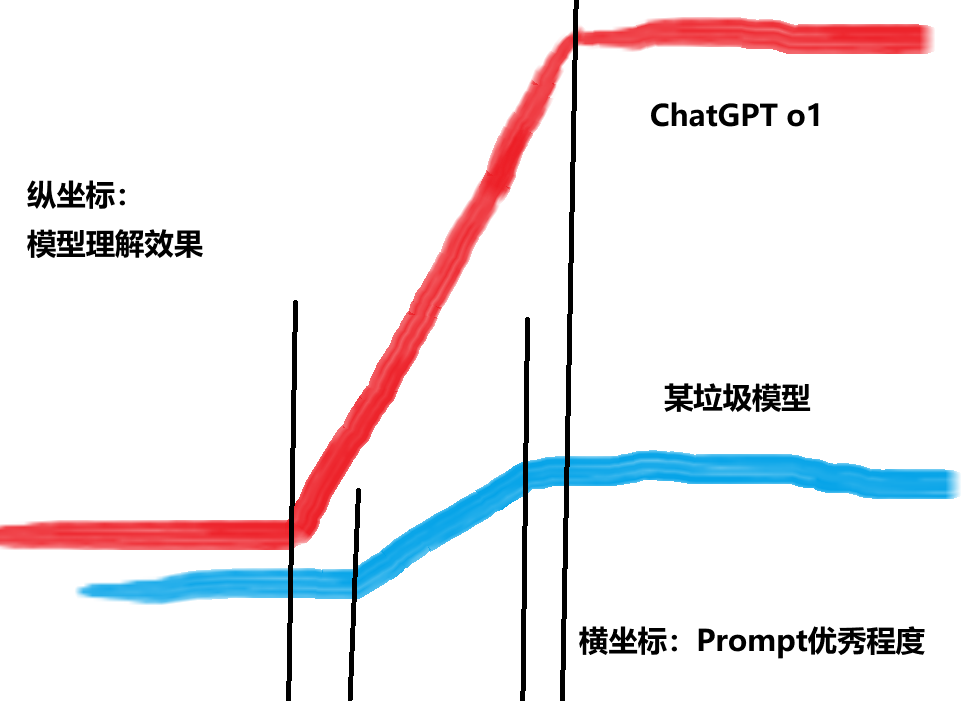

这，是一篇极简AI对话指南。

## 引入

今年六月，[农夫过河问题](https://baijiahao.baidu.com/s?id=1802849180926398961&wfr=spider&for=pc)让一众AI集体受挫。农夫明明不需要过河，各个大模型却都自顾自地详细解答。这就好像一个刷题刷很多的人，看到类似题型直接用套路去“秒杀”，而忽略了陷阱。

那我是AI的家长，肯定不希望AI粗心大意，告诫他要认真审题。这有用吗？很显然，学生时代过来的朋友们都知道，嘴上说着好嘟，考试还是马虎。AI也是众望不负，答得是一塌糊涂。但有人发现在类似的过河问题中，用“动物”替换“鸡”等名词替换的方式能让AI“恍惊起而长嗟”。是啊，改考题不就好了？多强调一次农夫不需要过河，AI才总算看见这个。

它太像人了。我们是否该重新审视提示词工程，或者说如何和AI对话？ 

## 与 AI 对话的本质

既然尝试把 AI 当人看，自然应该从**与人沟通**角度看待整个过程，它应该是：
```
我们的本义 -> 我们的表达 -> AI的理解 -> AI的表达
```
这当中的每一个环节都可能产生信息损失或扭曲。简单来看，把它转换成一个公式：

$$ 期望度 = 表达的本义保留率 * 理解表达的准确率 * AI表达的准确性 $$

只有前两项是作为AI使用者的我们用控制的，前者**重在内容**，后者**重在形式**。

## 内容：从本义到表达义

本义表达不清、沟通困难大多是以下三种情况：
- 话到嘴边，我们说不出这是**语言匮乏**，词汇量不够
- 讲了很多但其实有专门的词能替代、简化这是**知识匮乏**，认知不足
- 想解释却找不到例子、谈不出感想，可能是**经验匮乏**，经历太少

最佳的解决办法自然是“读万卷书，行万里路”。积累知识、经验和词汇周期比较长，如果遇到表达问题，也有**权宜之计**：

:::tip[让 AI 帮你表达]
尝试把相关的词语喂给 AI ，让它去搜索相关资料，告诉它你的感受，让它帮你表达。比如写文案时“权宜之计”这个词我一时脑子卡壳没想到，就问的 AI。


这种方式比较依赖于模型对你情况的理解能力，但是或多或少能帮你解决一些实际问题。你可以迁移到人与人的沟通当中，让AI帮你想如何回复别人的话。
:::

:::note[实用技巧]
内容的实用技巧如下，部分参考了说明文的说明方法：
1. 举例子：在提示词工程当中叫Few-shot，利用了模型的泛化能力
2. 下定义、作诠释：AI 对你提供的概念不一定有足够准确的理解，尝试下定义或作诠释
3. 打比方：可以用于辅助 AI 理解具体情境
4. 内容直白、清晰：阅读理解有“长难句”一说，和AI说话尝试用短句，减少累赘的形容词，我本人喜欢用冒号去表达对象的属性。
:::

## 形式：从表达义到理解义

个人认为，模型对 AI 的理解能力影响最大，它决定了理解能力的上限，自制配图，一目了然！



因此有时与其跟某些国产免费模型较劲半天，不如换个厉害的模型，马上就能get到你的意思。回到AI对话本身，理解效果受表达的方式和形式影响最大。

### 第一层：单轮和多轮

我们说的提示词（Prompt）常常是单轮对话的内容形式，但到现实沟通场景中寄希望于一次性完成信息对齐是不现实的。

为什么我们总寄希望于Prompt能一步到位？有没有可能多轮对话、层层递进会让AI有更好的理解呢？

这显然是形式的第一层，一次讲清 + 多轮改善还是多轮递进地讲清。

### 第二层：模块化

形式的第二层是**内容的结构**，也就是去年我们普遍看到的用 Markdown 格式写的提示词，通常每个模块代表一类要求。上个月爆火的17岁“天才”少年的Prompt其实用的也只是模块化的技巧。这一块的研究和成果最多，但日常使用AI写模块、写思维逻辑总是不太方便，以下是一些便捷的实用技巧。

:::note[实用技巧]
1. 思考方式：提示词有许多这方面的研究成果，Chain of thoughts(COT)、Tree of thoughts(TOT)、Metacognition(MC)等，日常提问对话使用它们实在比较麻烦。因此最简单实用的技巧是在你写的话最后加上一句，“Think step by step”，请你一步一步思考，也有一定效果。
2. 角色扮演：AI 过于全知，而通常我们希望得到的结果只是其中一个视角，角色扮演能获取我们需要的回答模式
3. 检查与自洽：AI 给出答案常常不负责任，要求 AI 检查自己的答案后修改再输出，或者要求 AI 从多角度答题并融合答案，能减少错误。
4. 奖励：尝试在最后一句加上激励，“如果你回答得全面、准确，我会给你奖励”，或许会有效果。
:::

### 第三层：逻辑表达

今年提示词工程普遍的趋势是用伪代码来写提示词，在模块化基础上更加重视特定任务的执行逻辑，李继刚用lisp语言，还有一些人用Python等等。伪代码的优势在于，编程语言当中if等逻辑语句、代码函数调用和执行逻辑等的含义已经十分明确，编程语言的形式让人的表达和AI的理解没有偏差。换句话说，是用伪代码的形式减少文字数量，进而减少理解偏差。

这也是为什么，一些研究提示词的人建议普通人不需要深入学习写提示词。事实也确实如此。

1. 对于提示词写的复杂任务，AI 执行的每一环节的信息传递都可能有偏差，最终结果的“稳定性”可能很差
2. 对于提示词写的简单任务，我相信提供一个流程图加必要的文字说明也能解决，不是说只能依靠单一的文字提示词来实现
3. 这类需要强逻辑和执行流程的任务更普遍的解决方式是用一些平台提供的Workflow，用多种类型的模块相连来完成，而非单一的提示词
4. 目前也有很多提示词工具能帮助你写，也可以让 AI 去生成，普通人不需要特地去学习编程
5. 最后，这类特定任务的场景普通人极少有

对于简单的逻辑，有以下实用技巧：
:::note[实用技巧]
1. 多分段多分点，让你的并列、顺序逻辑一目了然
2. 善用井号（标题）和冒号：内容的归属关系、解释一目了然
3. 各点内容使用含义明确的关联词，如“如果”“那么”“否则”，执行逻辑一目了然
:::

## 大道至简

使用 AI 不是向搜索引擎提问，也不像是一种结合艺术的技术，而是像和一位能交心的朋友的说话。我想大道至简，细看这所有这些实用技巧，抛内容和形式的风雷。其实它们都指向相同的目标——让AI以你设定的方式工作（输出），那么也都指向最本质的方法——讲清楚那所有的设定。

设定是什么——3W1H：
- Who：AI扮演什么角色？比如代码专家。
- What：AI要做什么任务？比如修改代码。
- Why：做该任务的原因是什么？比如解释你遇到的代码错误等。    
- How：AI如何完成任务？比如使用特定的思考方式。


怎么讲清楚
- 多用短句、简单句
- 用好标点，井号、冒号等
- 分段分点
- 用含义明确的关联词
- 举例子、下定义、作诠释、打比方

至此，与AI对话的一切，一目了然！