FPGA: 可编程的集成电路

:::note[说明]
教材：[《Digital Systems Design Using VHDL》](https://z-lib.gs/book/5336406/e02c50/digital-systems-design-using-vhdl.html)
:::

## 1.1 组合逻辑电路

组合逻辑电路之手当前输入影响；时序逻辑电路受当前和之前输入的影响。

Positive logic: 高电平为1，低电平为0（Negative logic 相反）

AND: C=A·B ; OR: C=A+B （这里的·和+不是四则运算，期末有布尔逻辑化简）

我们可以依据[真值表](../../../project/nand2tetris/1-1)来获得表达式。

- 与或表达式：看那些结果为1的行。我们把每一个不包含的或的项叫最小项。
- 或与表达式：看那些结果为0的行。

## 1.2 布尔代数与代数式化简

与0、1运算，  同一律、还原律、结合律、互补律、分配率

分配率用到 1.1 当中**与或表达式和或与表达式的转换**`X(Y+Z)=XY+XZ`，把与变或、或变与可以得到`X+YZ=(X+Y)(X+Z)`

化简定律、德摩根定律（求互补）

$$[f(X1,X2,...,Xn,0,1,+,·)]'=f(X1',X2',...,Xn',1,0,·,+)$$

先将与操作变为或操作，加上括号，再把或操作变与操作。

变量少的时候可以用韦恩图来化简、验证。

## 1.3 卡诺图

一组相邻的 1 代表一个变量相消，首行和末行、首列和末列也属于相邻。

X 表示不相关变量，根据需要随意定 X 为 1 或 0。

与或表达式：
1. 圈 1 ，哪些是基本质蕴含项，然后再圈尽量少的非基本质蕴含项（可以由不同的相邻的组来包含进）
2. 把每个项 + 起来

同样，或与表达式就是圈 0 ，把每个项 + 起来得到`G'`之后用狄摩根定律求。

引入更多变量的卡诺图：

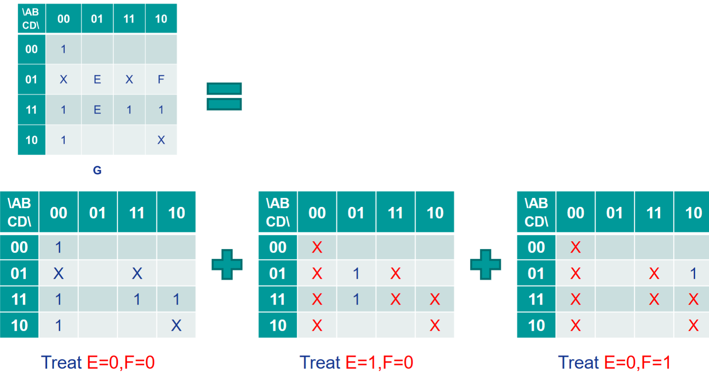

## 1.4 只用与非门和或非门设计

略

## 1.5 组合逻辑的冒险

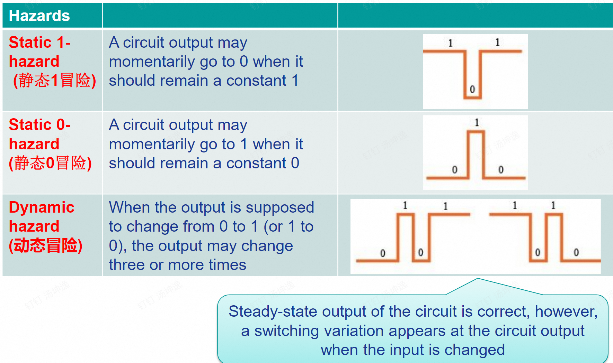

在硬件上可能由于每个门执行需要时间，导致发生这种短暂的突变，从卡诺图看，原因在于变换时，质蕴涵项没有交叠。

## 1.6 触发器和锁存器

- 锁存器(latch): The outputs are constantly affected by their inputs as long as the enable signal is asserted.
- 触发器(flip-flop): Their content change only either at the rising or failing edge of the enable signal. 

*说明：下面的`Q+`表示下一个时刻的值。

### 时钟 D 触发器

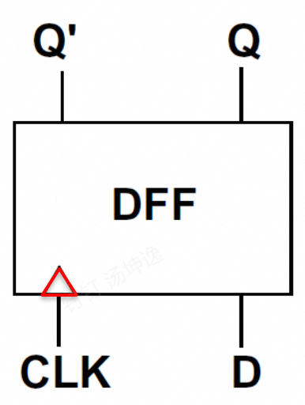

CLK 时钟信号上升沿（三角形）到来时 Q 输出为 D的输入`Q+=D`。[VHDL代码](../2#26-用-vhdl-进程建模modeling触发器)

### 时钟 J-K 触发器

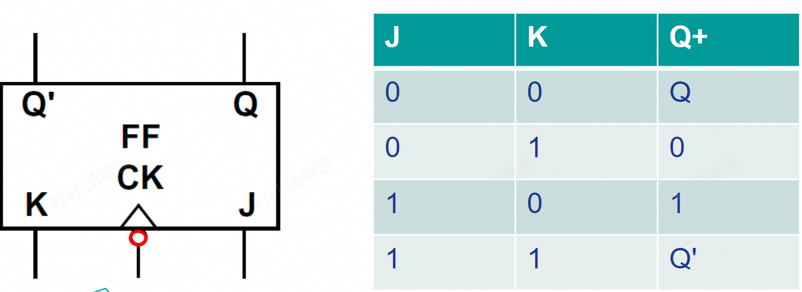

CLK 时钟信号下降沿（三角形和空心圆）到来时 `Q+=JQ'+K'Q`

### 时钟 T 触发器

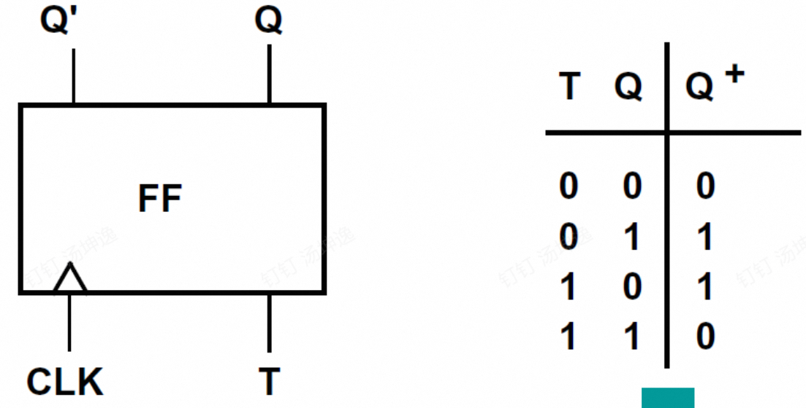

CLK 时钟信号上升沿到来时，异或操作`Q+=Q'T+QT'`

### S-R 锁存器

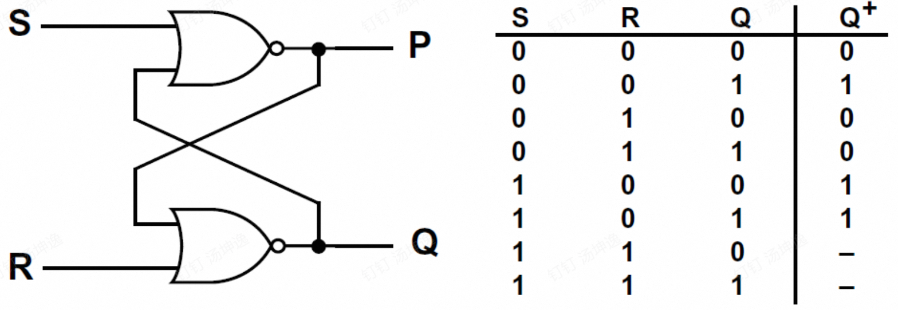

最后两行是不稳态不使用。`Q+=S+R'Q`

### 门控 D 触发器

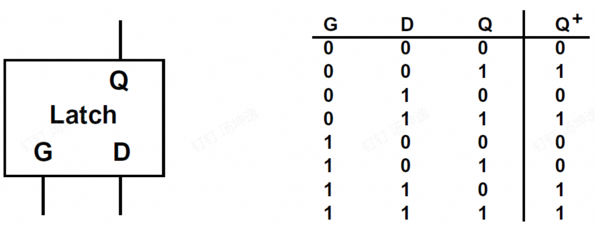

`Q+=GD+G'Q`，如果画出卡诺图是可能存在静态冒险，可额外设计一个`DQ`加入到右式。

## 1.6 Mealy 型电路设计

| 电路 | 输出依赖于 |
| --- | --- |
| Mealy | 1. 当前状态 2. 当前输入 |
| Moore | 当前状态 |

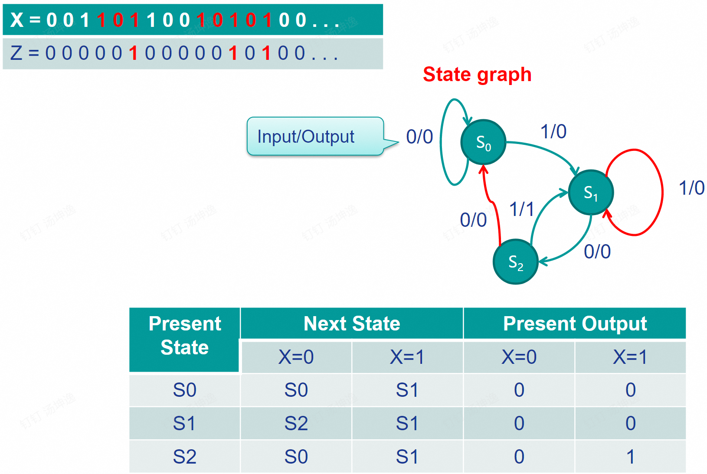

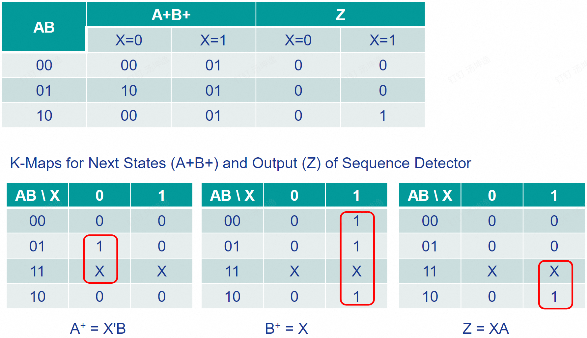

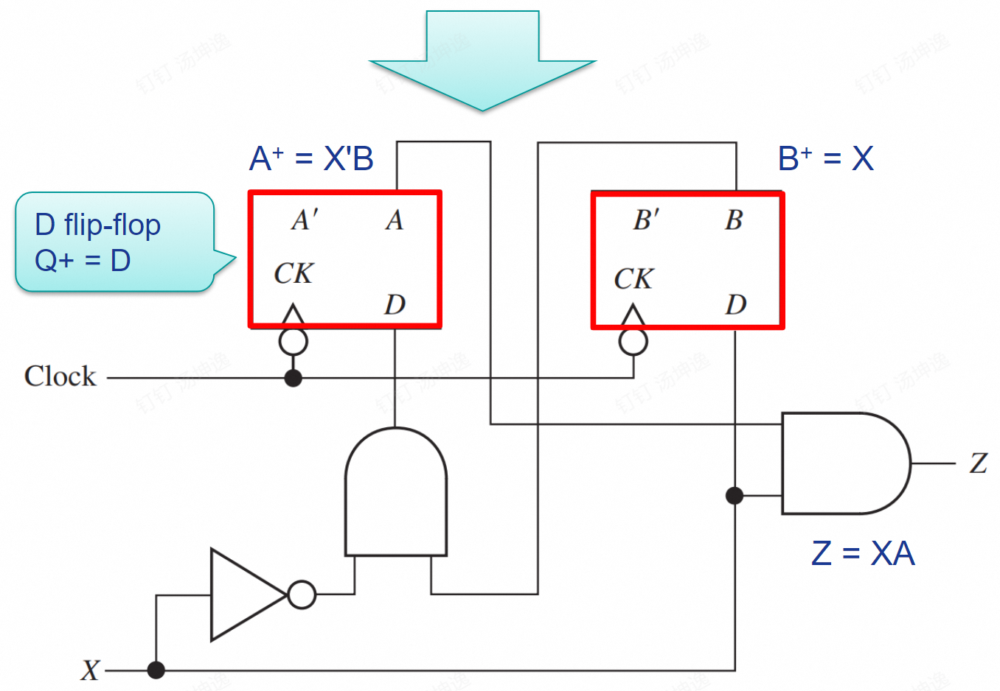

1. 设计 Mealy 状态图：使状态数尽可能少
2. 按照优化原则设计每个状态的值
3. 根据状态值画出 Q1Q2… 的状态转移表
4. 把表中每个量作为输出，画出卡诺图和表达式
5. 依据所有表达式画出电路图

## 1.7 Moore 型电路设计

很好理解，我想要输入101时输出一个1那么，输入1进入到一个新状态，再输入0就进入第二个新状态，再输入1进入第三个新状态并输出1。

## 1.8 等价状态

看相同的输入是否有相同的输出。可以按如下方式画出表，再对应去删除。

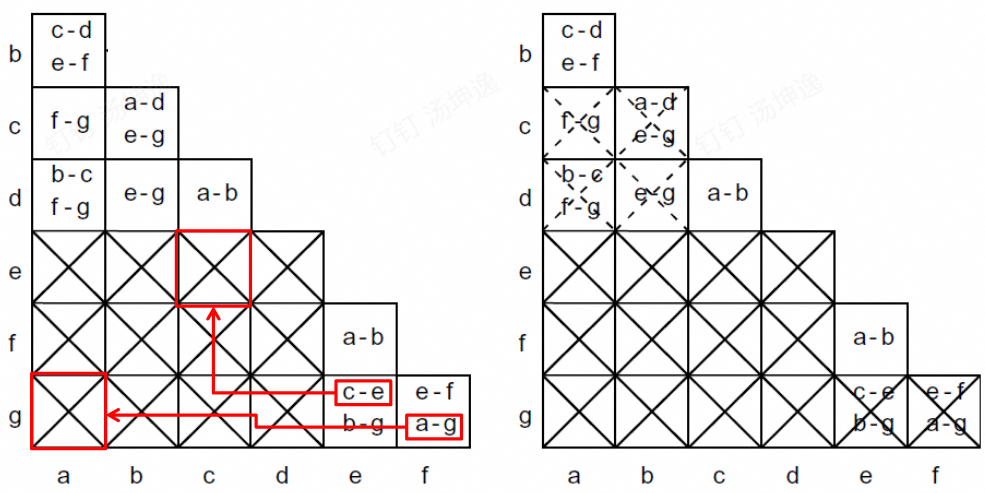

## 1.9 三态门电路

门电路实物直接相连会存在问题，因此设计了包含高阻态的三态门。

